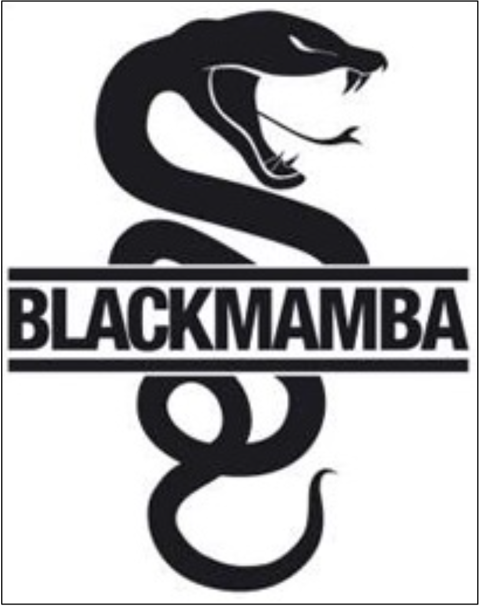
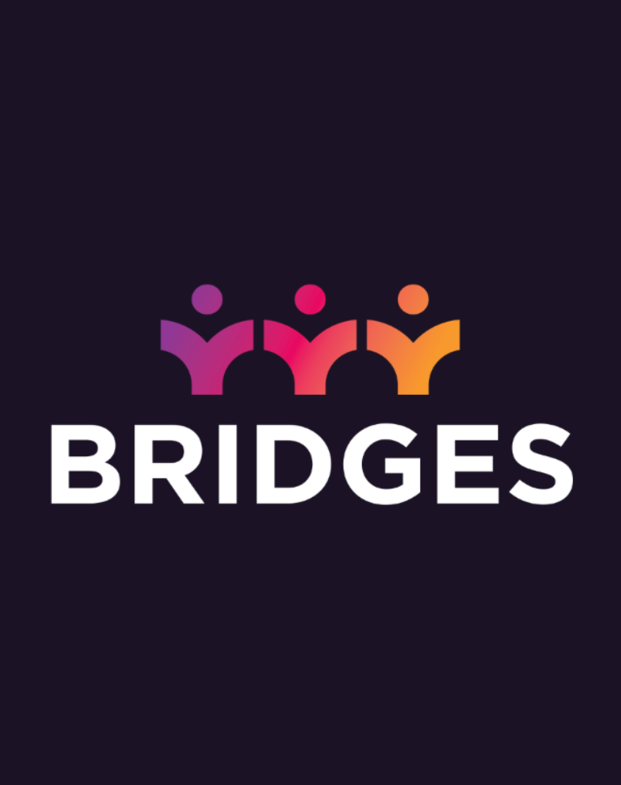
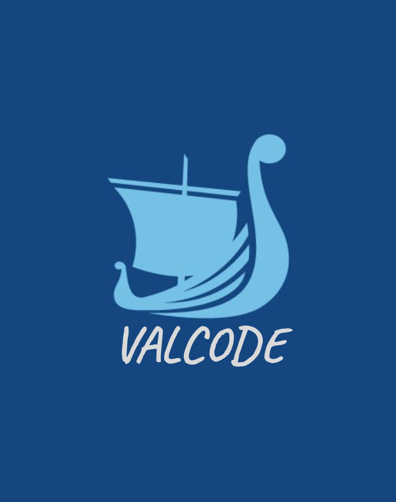
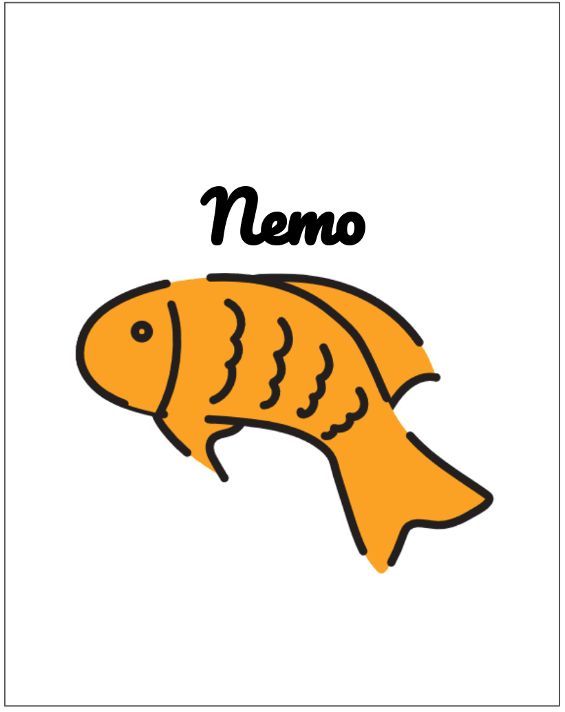
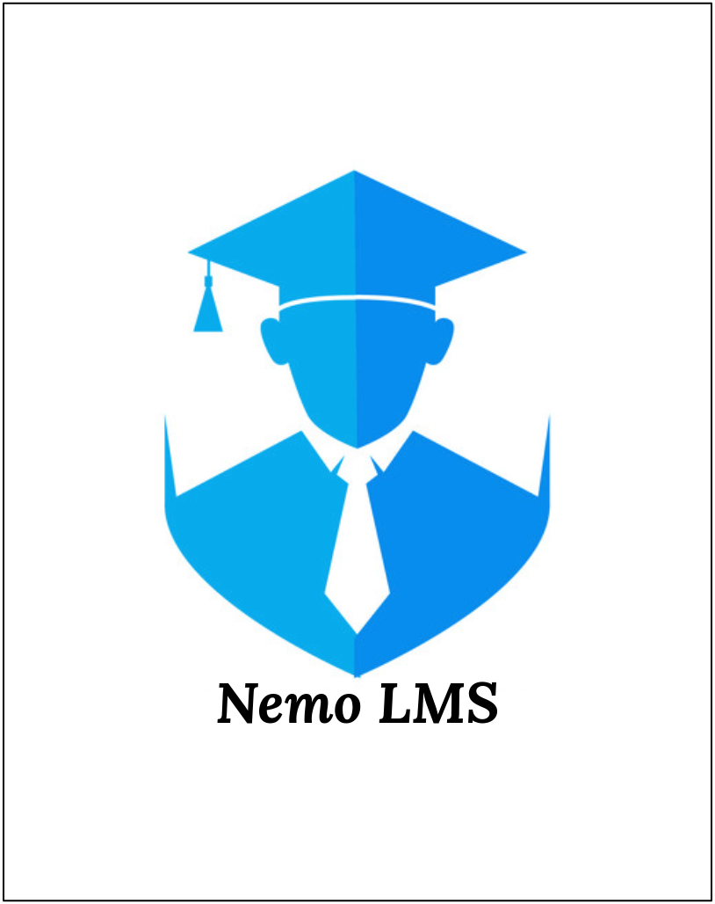
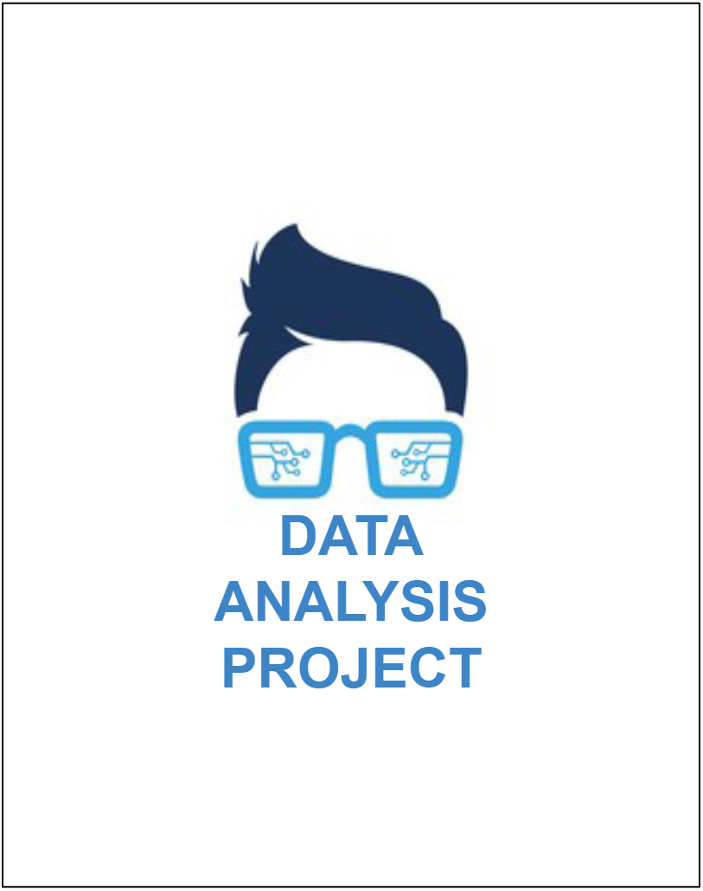

<h1> Portfólio de Projetos Integradores FATEC-SJC - Daniel Delgado </h1>

 
  
  
  
  
   
   
   
  
  
  

 
### **Sobre mim**
 

Meu nome é Daniel Delgado Rocha Santos da Silva, sou formado em Engenharia de Produção pela ETEP Faculdades-SJC e curso Banco de Dados na FATEC-SJC.  
Trabalho como desenvolvedor desde 2018, antes de trabalhar com T.I. tive a oportunidade de atuar em excelentes empresas na área de Engenharia de Produção, em funções de analista nos departamentos de PCP, Projetos, Supply Chain e Co-packer. Essa bagagem me faz diariamente ter uma visão e um comprometimento além do que "apenas programar/codar", buscando da melhor maneira agregar valor ao resolver um problema ou criar/melhorar algo.  
Atualmente trabalho como Desenvolvedor Backend na DMCard, onde sou membro do time que mantém e desenvolve o produto [DMApp](https://play.google.com/store/apps/details?id=br.com.dmcard.contadigital).

### **Contato**
* [Github](https://github.com/aerosdan/)
* [Gitlab](https://gitlab.com/DNLMR)
* [LinkedIn](https://www.linkedin.com/in/daniel-delgado-274096194/)
* E-mail: daniel.delgado.rocha@gmail.com
 
### **Principais Conhecimentos**
* Python 
* Golang 
* JS 
* API Rest 
* MySQL, Postgre, Oracle, MS SQL, Mongo DB 
---
# **PROJETOS DESENVOLVIDOS**

  <kbd></kbd>
  &nbsp;&nbsp;&nbsp;&nbsp;
  <kbd></kbd>

  <kbd></kbd>
  &nbsp;&nbsp;&nbsp;&nbsp;
  <kbd></kbd>

  <kbd></kbd>
  &nbsp;&nbsp;&nbsp;&nbsp;
  <kbd></kbd>

---

# 🐉 Black Mamba 🐉
  

 
  
  
  

Parceiro acadêmico: FATEC  
Aplicação: Web-bot  
Repositório GIT: [Black Mamba](https://github.com/aerosdan/black_mamba)  
Período de desenvolvimento: 2º Semestre 2019
 
## **Descrição do Projeto**
 
O Black Mamba foi desenvolvido com a intenção de ser uma solução para um público com interesse em investir em ações, porém sem tempo para adquirir conhecimentos mais densos do assunto. Foi desenvolvido inteiramente em Python e para a versão de desenvolvimento fixamos o banco Inter como empresa a ser utilizada. A aplicação tem as seguintes features:
 
* Obter histórico das ações nos últimos 12 meses - é feita uma primeira 'carga' dos valores das ações à fim de ter um comparativo, essa carga é salva no banco de dados;
* Web-scraping em 'tempo real' dos valores das ações - a aplicação monitora o valor das ações durante o dia e salva em um banco de dados próprio;
* Cadastro de Usuário - o usuário se cadastra na aplicação através do Telegram para receber alertas automáticos do web-bot com dicas "venda a ação / compre a ação";
* Análise de Dados + Notificações - O bot processará os dados obtidos das ações no web-scraping e notifica os usuários, por Telegram e e-mail, caso haja uma situação oportuna para venda/compra da ação;  
* Atendimento automatizado - também é possível que o usuário interaja com o bot a fim de obter algumas informações que gostaria, como gráfico com os valores das ações e maior/menor valor da ação no dia;
              
Essa solução ajudaria pessoas inexperientes em investimentos em ações que querem começar a investir. Devido à complexidade da bolsa de valores é preciso reforçar que o 'core' dessa aplicação foi montar o web-scraping (obtenção dos valores da ação em tempo real) juntamente com um web-bot que é tanto proativo (notificações de oportunidades) como reativo (interações automatizadas) e que o algoritmo de projeção dos valores da bolsa não foi o foco, tendo sido aplicada uma regra simplificada para confirmar eventos oportunos de investimento.
 
## **Tecnologias Utilizadas**

**Python** - praticamente todos da equipe tinham um conhecimento prévio - em diferentes níveis - na linguagem, então optamos por utilizá-la pois com isso conseguimos proporcionar uma boa curva de aprendizagem para todos os integrantes: os que já conheciam poderiam auxiliar os demais à iniciar na linguagem e também construir um conhecimento mais aprofundado para si mesmos, uma vez que já contavam com um certo alicerce;
 
**MySQL** - escolhemos este SGBD relacional tanto pela familiaridade do time com a ferramenta quanto pela disponibilização de um banco em cloud de graça;
 
**Lib Selenium** - o pacote Selenium foi usado para automatizar a interação da aplicação com o navegador da web a partir do Python, especificamente para acessar o site onde os dados das ações ficam;
 
**Lib Beautiful Soup** - o pacote Beautiful Soup foi usado para extrair dados de arquivos HTML e XML, sendo possível através dele navegar e pesquisar pelas informações disponibilizadas na origem dos dados que fizemos a coleta de dados.
 
## **Contribuições Pessoais**
 
**Desenvolvimento** - Nesse projeto atuei no desenvolvimento das interações do bot com o usuário por e-mail e pelo Telegram.
Foram desenvolvidas diferentes rotinas para enviar as notificações:
* notificações automáticas e proativas - enviadas em momentos dinâmicos e oportunos para investimento;
* interações reativas - executam apenas sob demanda do usuário;
* relatórios diários - visam informar o cliente do fechamento de um dia.
Essa gama de diferentes formas de interagir com a aplicação agregaram valor à experiência do usuário pois possibilita que cada um personalize e utilize a ferramenta da forma que mais lhe agrada.
 
## **Hard Skills Desenvolvidas**
 
**Conhecimento em Python** - Pude aprimorar meus conhecimentos em recursos importantes na linguagem. Essa experiência, além de me ajudar em todos os outros projetos, servem de base atualmente e contribui na minha rotina profissional:
* Interação com Email - mime types; 
* Interação com Bot Telegram - automatização do bot;   
* Interação com MySQL através do Python - CRUD; 
* Pandas, Selenium, Beautiful Soup - funcionamento das bibliotecas;
 
## **Soft Skills Desenvolvidas**
 
**Trabalho em Equipe** - as dinâmicas aplicadas pelos Master contribuíram para o fortalecimento da equipe, tornando-a uma equipe sinérgica, assertiva, resolutiva e focada na qualidade dos resultados;

**"Aprender a aprender"** - tivemos bastante contato com os Masters do 6º semestre que auxiliaram e contribuíram com as trocas de experiências. Esse contato, promoveu a reflexão  da equipe e fortaleceu a construção do conhecimento com o aprendizado de novos conceitos. 

  

---

# 🌉 Bridges 🌉

 
  
  
  

Parceiro acadêmico: Necto  
Aplicação: Plataforma para planejamento de tarefas no dia-a-dia (Gráfico GANTT)   
Repositório GIT: [Bridges](https://github.com/aerosdan/bridges)  
Período de desenvolvimento: 1º Semestre 2020

## **Descrição do Projeto**

O projeto Bridges visa permitir que o usuário cadastre todos os aspectos de seu ambiente de desenvolvimento (pessoas, projetos, tarefas) e por meio de uma interface prática e interativa permite que o usuário consiga elaborar e analisar cenários referentes ao planejamento de seus projetos e horas disponíveis de desenvolvimento. A aplicação tem as seguintes features:
* Cadastro de Funcionários - permitir o usuário cadastrar Funcionários e carga horária de trabalho de cada um deles; 
* Cadastro de Projetos e Tarefas - permitir cadastrar Projetos (nome do projeto/cliente) e Tarefas do projeto - cada uma com suas respectivas descrições e tempo estimado para conclusão; 
* Fazer relações entre as entidades - atribuir tarefas para um projeto / funcionários para uma tarefa;
* Interface para o usuário - apresentar às entidades acima de forma clara de forma a destacar possíveis GAPs de horas disponíveis x horas utilizadas. 

## **Tecnologias Utilizadas**

**Python** - foi escolhida a linguagem Python pois entendemos que facilitaria a entrega do projeto (que era mais densa que o primeiro); 
 
**MySQL** - a escolha deste SGBD relacional foi pelo fato que no primeiro API configuramos um ambiente em cloud para essa instância, o que facilitou a integração e configuração deste novo projeto com o Banco de Dados;
 
**Django** - o framework proporcionou à equipe agilidade em desenvolver em conjunto de uma forma simplificada (centralizando front e backend na mesma aplicação com facilidade), além de ser bem consolidado no mercado e ter uma comunidade muito ativa para pesquisarmos dúvidas e materiais de aprendizagem.

## **Contribuições Pessoais**

**Referência técnica DJANGO** - Após a definição de trabalhar com o Framework Django consegui me aprofundar bem no funcionamento da ferramenta. De tal forma que mesmo com a equipe dividida em frentes (back/front) e eu não tendo muito conhecimento em front-end, consegui auxiliar todos os membros do time tecnicamente;

**Arquitetura** - A estrutura de pastas do repositório e o entendimento da arquitetura MTV (model, template, view) do Framework foram aplicadas conforme documentação e aprimoradas conforme andamento do projeto;

**Modelagem de dados + Models (django)** - Primeiramente elaborei o modelo relacional junto à criação das tabelas "na mão" (DDL) para demonstração e testes fora da aplicação. Após testes e ajustes com uma versão mais 'definitiva', passei essa camada para dentro do framework, agregando tanto ao time de desenvolvimento (com as facilidades que o ORM do Django traz) quanto para manutenção da base de dados pela dinâmica de migrations;
 
**Templates (django)** - De forma parecida com os models fizemos as views primeiramente em Wireframe: esboçando como ficariam as telas. Na sequência Construímos fora do framework (em html/css/js) uma versão mais detalhada do front. Finalmente fizemos a conversão do front para o Python/Django usando toda a estrutura de herança que o framework permite;
 
**Views (django)** - As views do DJANGO são semelhantes aos Controllers da arquitetura MVC. Aqui estão as regras de negócio da aplicação e é onde determina o que será apresentado no front - destaco para "O QUE", e não "COMO', uma vez que a view está à nível de backend apenas disponibilizando a informação para o Front. Foram desenvolvidas funcionalidades CRUD para todas as entidades e cada uma delas linkadas a um endpoint diferente com seus respectivos forms para interação do usuário.
 
## **Hard Skills Desenvolvidas**
 
**Modelagem de Banco de Dados** - criar, testar e explorar uma modelagem antes de programar foi muito importante nesse projeto. Alguns aspectos do projeto precisaram ser adaptados e alterados conforme sua evolução, demandando e estimulando a adaptabilidade, usar ferramentas auxiliares para manutenção do banco (oriunda do próprio Django) foi essencial;

**Framework DJANGO** - este projeto foi introdutório para mim nesse framework, pela posição que estava pude ver o poder da ferramenta e após o projeto me aprofundei ainda mais na questão de backend. Esse contato resultou em hoje eu ter um conhecimento melhor em API Rest e como é feita interação com o frontend;

**Dinâmica de Frontend** - tendo uma preferência pelo back-end, desenvolver um pouco no front foi oportuno para mim pois desmistificou diversas dúvidas e questionamentos. Pude observar como a dinâmica de herança nos templates pode imprimir velocidade no desenvolvimento e manutenção do front.
 
## **Soft Skills Desenvolvidas**
 
**Liderança** - a oportunidade de trabalhar e aprender o Framework foi motivacional para mim, com isso pude muitas vezes 'puxar' o time para fazermos uma entrega melhor e mais aprimorada. Por estar extremamente engajado no projeto pude também exercer a função de 'ponto de apoio' para o time no tangente à dúvidas (técnicas e de negócio), tendo contribuído de forma geral com ideias boas para o desenvolvimento;

**Trabalho em Equipe** - nessa função central pude aprender que uma call com 4 pessoas engajadas é infinitamente melhor do que apenas uma pessoa ou até duas programando, ao longo do projeto fui aprimorando técnicas para juntar a equipe em momentos importantes para tomar a decisão em conjunto, trazendo mais precisão nas soluções.

  

---

# ⚔️ Valcode ⚔️

 
  
  
   

Parceiro acadêmico: SPC  
Aplicação: Plataforma de interação de um usuário final (PF) com informações tangente à seu Score  
Repositório GIT: [Valcode](https://github.com/aerosdan/valcode)  
Período de desenvolvimento: 2º Semestre 2020  

## **Descrição do Projeto**
 
O Projeto VALCODE tem a intenção de introduzir o usuário - que na maioria dos casos é uma PF - à dinâmica de Score. Apresentando por meio de uma aplicação WEB como está a saúde do seu score assim como os motivos para tal status e  apresentando dicas de como poderia melhorar seu score e até mesmo atuar em outras frentes - como investimentos em ações - caso seu score esteja com uma boa pontuação. O projeto possui as seguintes features:
* Cadastrar Usuários;
* Conceder, estender ou revogar acessos aos próprios dados;
* Calcular Score;
* Cadastrar transações financeiras (contas pagas, à pagar, vencidas, empréstimos, etc.);
* Geração de relatórios;
* Importação / Exportação de dados em/para arquivo;
 
## **Tecnologias Utilizadas**
 
**Java** - a linguagem foi fixada pela FATEC;

**Spring-boot** - o framework possibilitou termos mais agilidade em desenvolver em conjunto. Além de ser bem consolidado no mercado e ter uma comunidade muito ativa para pesquisarmos dúvidas e materiais de aprendizagem;

**Oracle** - o SGBD foi fixado pela FATEC.
 
## **Contribuições Pessoais**
 
Neste projeto atuei principalmente na camada de banco de dados. Também contribui organizando e orquestrando o time para termos boas entregas no desenrolar do projeto (SCRUM MASTER).
 
**Base de Dados** - Fiquei responsável pelo database inicial direto no SQL e gerei dados mockados para o restante da equipe utilizar até termos um dataset disponibilizado pelo cliente. Com o andamento do projeto fomos controlando o banco através do Spring-boot (model) e adicionando as funcionalidades de interação nessa camada da aplicação;

**SCRUM Master** - Consegui contribuir bem com ideias para construir o escopo do produto final, assim como manter o foco do time nestes objetivos iniciais ao longo do projeto. Também apoiei o time de desenvolvimento nas definições dos focos (funções) que cada integrante teria e contribuindo em casos de problemas técnicos (debugs).

## **Hard Skills Desenvolvidas**

**Modelagem de Banco de Dados** - criar, testar e explorar a modelagem;
 
**Spring-boot** - pude ser introduzido ao framework, no início tive certa dificuldade em performar na ferramenta devido o 'choque de linguagem', mas desprendendo algum tempo de estudo, vendo alguns repositórios no git de códigos consolidados e recebendo uma ajuda dos outros membros em dúvidas mais pontuais, pude ver semelhanças e correspondências entre outras ferramentas utilizadas previamente. Com esses aspectos a curva de aprendizagem foi sendo mais facilitada.

## **Soft Skills Desenvolvidas**

**Resiliência** - a fim de contribuir da melhor forma para o time em um cenário onde a utilização do JAVA era obrigatória, escolhi funções dentro da equipe para que pudéssemos aproveitar melhor a experiências de alguns membros que tinham mais vivência e familiaridade com a linguagem.

  

---

# 🐟 Nemo 🐟

 
  
  
   

 
Parceiro acadêmico: GSW  
Aplicação: Plataforma para uso de uma empresa para realizar match entre uma vaga de trabalho com requisitos x candidatos  
Repositório GIT: [Nemo](https://github.com/aerosdan/nemo)  
Período de desenvolvimento: 1º Semestre 2021
 
## **Descrição do Projeto**
 
O Projeto NEMO visa entregar uma aplicação que resolva o problema de "match" entre candidatos e vagas, onde se possa alcançar os melhores candidatos para as vagas apresentadas com seus diversos requisitos.
 
## **Tecnologias Utilizadas**
 
**Java/Springboot** - linguagem/framework escolhida devida à familiaridade dos membros da equipe;
 
**PostgreSQL** - este SGBD foi escolhido por apresentar uma excelente ferramenta para trabalhar com informações geográficas e índices espaciais: o PostGIS.
 
## **Contribuições Pessoais**
 
**Administração do Banco de Dados** - Neste projeto fiquei responsável pela Administração do Banco de Dados, tendo elaborado o modelo relacional inicial de nossas Bases, realizando adaptações com o desenvolver do projeto. Também desenvolvi Triggers e Procedures. Essas automações foram responsáveis por fazer a seleção de candidatos ao lançar uma vaga com requisitos, trazendo em "tempo real" a lista de candidatos logo após cadastrar uma vaga trazendo uma resposta praticamente instantânea para o usuário da aplicação.
 
## **Hard Skills Desenvolvidas**
 
**PL/pgSQL** - neste projeto pude explorar opções interessantes de triggers e procedures no Postgre, que me ajudaram a entender pontos positivos e negativos da ferramenta e como melhor utilizá-la no futuro;
 
**PostGIS** - fui introduzido a esta ferramenta e pude me aprofundar ao longo do projeto para auxiliar a busca de candidatos para uma determinada vaga que solicitasse proximidade a empresa.
 
## **Soft Skills Desenvolvidas**
 
**Comunicação** - como praticamente um DBA desenvolvi bem a comunicação com a equipe responsável por desenvolver no SpringBoot, a fim de deixá-los munidos de informações atualizadas e precisas, além de estar disponível para auxiliar em eventuais problemas com dados no banco.

  

---

# 🐠 LMS Nemo 🐠

 
  
   

 
Parceiro acadêmico: NESS  
Aplicação: LMS com Chat  
Repositório GIT: [LMS Nemo](https://github.com/aerosdan/nemo-lms)  
Período de desenvolvimento: 2º Semestre 2021
 
## **Descrição do Projeto**
 
Desenvolver uma solução de dados voltada ao ensino à distância para a gestão e oferta de conhecimento, dando suporte às mais diversas arquiteturas de aprendizagem, alinhado com os objetivos estratégicos a serem alcançados por cada organização que atendemos como clientes. Fazer a gestão de logs para alimentar um Data Warehouse a fim de possibilitar a melhor gestão estratégica do negócio.
 
## **Tecnologias Utilizadas**
 
**Python** - a escolha dessa linguagem foi devido ter uma implementação eficaz e simplificada tanto para interação com as bases de dados escolhidas (Mongo) quanto para tratamento de dados, sendo a mesma altamente recomendada e utilizada para essa finalidade no mercado de trabalho;
 
**MongoDB** - este SGBD não relacional nos garantiu uma fácil interação entre código e dados além de proporcionar uma simplicidade na manutenção dos dados ao longo do projeto;
 
**Rocket Chat** - este sistema de Chat "plug and play" foi facilmente integrado à nossa solução, a escolha e implementação dele foi devido identificarmos que poderíamos usar uma ferramenta já pronta e 'acoplar' no projeto para que pudéssemos nos dedicar à requisitos mais específicos que demandaram desenvolver literalmente do 0 devido a solicitação do parceiro acadêmico;
 
## **Contribuições Pessoais**

**Decisão da ferramenta de ETL** - No início do projeto fizemos testes em ferramentas consolidadas no mercado para realizar o trabalho do ETL (Pentaho, Talend), porém estas opções iriam demandar uma curva de aprendizagem para masterizar e aplicar à nossa realidade. Portanto, decidimos partir para uma abordagem mais objetiva e que iria nos permitir AGILIDADE nas entregas e garantindo qualidade e assertividade nas mesmas, optando então por programar direto em Python para essa demanda;

**ETL** - trabalhamos na ingestão de dados de forma a manter o DW de forma eficiente. Efetuando a extração dos dados do "sistema-fonte", transformando esses dados em um formato que possibilita serem analisados e por fim carregando os dados tratados em uma base de dados (DW).
 
## **Hard Skills Desenvolvidas**
 
**Python** - aplicabilidade da linguagem para interações com MongoDB e transformação de dados, obtendo dinâmicas para esse processo que melhoram performance e exatidão. A conversão e manipulação de dados assim como criar mecanismos para 'converter' dados de uma base para outra de forma a garantir uma certa unicidade dos dados foram focos que permitiram um aprendizado interessante;  
 
**MongoDB** - interações com o banco NoSQL, podendo conhecer os benefícios de um banco não relacional, mas podendo ver também em que eles poderiam não ser tão indicados;
 
## **Soft Skills Desenvolvidas**
 
**Comunicação** - a tarefa de construir o ETL exigiu que fosse feitos diversos alinhamentos tanto com a área do DW quanto com a área responsável pelos dados de entrada (dados mockados) de forma a garantir um resultado final otimizado e dentro dos requisitos;  
  
**Inteligência emocional** - com um ano de pandemia e perto do final do ano o time estava notavelmente esgotado física e psicologicamente, neste projeto foi importante saber lidar em uma situação anti-produtiva para conseguir entregar algo de valor, lidando com diferentes timings de entusiasmos.

  

---

# 🔎 Data Analysis Project 🔎

 
  
  

 
Parceiro acadêmico: Projeto desenvolvido na matéria "Projeto de Banco de Dados Não Estruturados" do professor Fernando Masanori  
Aplicação: Análise de Dados Eleitorais (Brasil)  
Repositório GIT: [Análise de Dados](https://github.com/aerosdan/data-analysis)  
Período de desenvolvimento: 1º Semestre 2022  
 
## **Descrição do Projeto**
 
O projeto tem por objetivo proporcionar a um Telejornal da região do Vale do Paraíba uma análise de dados com a exibição de estatísticas do eleitorado localizado dentro de sua cobertura no Estado de São Paulo. As análises deveriam mapear características do eleitorado, como estado civil, escolaridade e faixa etária, informações sobre renda da cidade/região e evolução na quantidade de eleitores, tanto no âmbito municipal (de cada cidade) quanto nas macro-regiões, como o Vale do Paraíba.
 
## **Tecnologias Utilizadas**
 
**Jupyter Notebook** - o uso do Jupyter Notebook possibilitou desenvolver a solução de forma mais lúdica, uma vez que através dos blocos de texto podemos explicar o contexto da análise assim como o objetivo do nosso projeto, o conhecimento que está sendo extraído dos dados e as conclusões, ou seja, as possíveis soluções para o problema que estamos tentando resolver;
 
**Pandas** - está lib foi utilizada para manusear os dados, combinando recursos de manipulação dos dados e funcionalidades sofisticadas para facilitar todas as operações com os dados (execução de agregações, selecionar subconjuntos de dados, etc.);
 
**Matplotlib** - biblioteca Python utilizada para produzir gráficos.
 
## **Contribuições Pessoais**
 
**Desenvolvimento da análise** - o desenvolvimento das análises foram realizados em um jupyter notebook e contemplam diversos pontos: classificação do eleitorado em diversas características, estatísticas sobre a renda média, porcentagem de eleitores presentes/ausentes, evolução do número de eleitores. O notebook também permite customizar "variáveis de ambiente", possibilitando configurar o ano da eleição que o usuário quer analisar e também escolher algumas cidades para que seja possível analisar indicadores especificamente dessas cidades;
 
**Checklist de arquivos de dados** - os dados utilizados neste projeto precisam ser obtidos de forma manual, no caso através de plataformas do governo brasileiro (TSE/IBGE). Com a finalidade de tornar mais fácil compreender se temos tudo pronto para rodar o projeto, foi criado um 'checkpoint' no notebook que valida se todos os arquivos necessários estão presentes no repositório. Com isso evitamos quebrar análises ou até mesmo ter análises imprecisas de evolução por falta de atenção à estes requisitos do projeto;
 
**Funções multiuso** - com a finalidade de não ter linhas de código repetidas na análise, foi aplicado o princípio "Don't repeat yourself" (DRY), onde foram criadas funções para possibilitar sua reutilização ao longo da análise (exemplos: função para carregar os DF, função para adicionar labels aos gráficos, funções arredondamento porcentagem, etc.);
 
**Melhorias nos gráficos de estatística** - no início do projeto usei diversos gráficos de pizza envolvendo porcentagens para demonstrar alguns comparativos retirados dos dados, porém ao longo do projeto fiz adaptações para os comparativos fossem apresentados em cima das quantidades envolvidas, de forma a melhorar a forma com que a análise transmite as informações. O gráfico de pizza possuía alguns pontos negativos: a quantidade representada por fatias não é tão fácil de compreender para as pessoas em geral e existia dificuldade em mostrar categorias com pequenas porcentagens, ambos estes aspectos foram eliminados ao trocar por um outro tipo de gráfico;
 
**Exportação das análises** - o processo de manusear os dados originais com a finalidade de realizar as análises, seja realizando filtros ou agregando informações destes dados, acaba gerando novos dados como resultados (exemplo: contagem de eleitores que votaram e que não votaram na cidade de São José dos Campos). Com isso foi desenvolvido também uma forma de exportar esses dados 'finais/novos' de cada análise em formato '.csv';
 
## **Hard Skills Desenvolvidas**
 
**Jupyter Notebook** - Ao me deparar com o requisito de desenvolver em um ambiente diferente do 'tradicional' para desenvolvimento em Python, precisei estudar o funcionamento do ambiente jupyter notebook. Conforme eu fui me aprofundando no estudo e colocando em prática pude perceber cada vez mais a facilidade de desenvolver esse tipo de projeto (análise de dados) em um ambiente Jupyter Notebook. A ferramenta possibilitou descrever a 'linha de pensamento' da análise, deixando claro o que está sendo desenvolvido quase que passo-a-passo, agregando muito valor à análise e ao projeto como um todo;
 
**Python para Análise de Dados** - este projeto possibilitou trabalhar e aprender uma stack bem consolidada no mercado para Análise de dados: python, notebooks, pandas, matplotlib e numpy. Pude aprimorar o conhecimento em Python e conhecer um 'universo' diferente do que costumo trabalhar em desenvolvimento. Tive uma boa curva de aprendizagem, oque se deu bastante pela facilidade de achar bons materiais para estudo sobre os temas e também pude perceber ao longo do desenvolvimento deste projeto as facilidades da linguagem para fazer análise de dados, com comandos simples e funções intuitivas foi possível chegar no resultado esperado.
 
## **Soft Skills Desenvolvidas**
 
**Organização** - este projeto demandou uma organização do ambiente de desenvolvimento como um todo para que o tempo fosse bem aproveitado. Desde organização das atividades até como organizar links úteis com as informações cruciais para o desenvolvimento do projeto foram essenciais para trabalhar de forma mais rápida e eficaz e diminuir a suscetibilidade aos erros ou falta de fixação de conhecimento;
 
**Autogerenciamento** - com o intuito de ser mais produtivo foi necessário autogerenciar meu tempo para desenvolver o projeto de forma eficiente sem deixar outras frentes do próprio curso para trás. Para isso criei uma agenda que evoluiu conforme o projeto: primeiramente o tempo foi dedicado ao estudo para me habilitar a mexer com as ferramentas propostas no projeto (jupyter, pandas), na sequência foi necessário entender os dados que estaria usando para assim ter mais facilidade de desenvolver o projeto e por fim tempo realmente desenvolvendo e aprendendo sob demanda.
 
  

---
