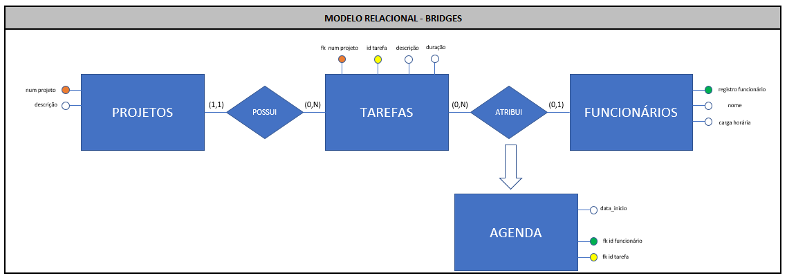

# Portfólio de Projetos Integradores FATEC-SJC - Daniel Delgado

# About me

Meu nome é Daniel Delgado Rocha Santos da Silva, sou formado em Engenharia de Produção pela ETEP Faculdades-SJC e curso Banco de Dados na FATEC-SJC. Passei por empresas excelentes durante minha carreria atuando fortemente na área de PCP, Projetos, Supply Chain e Co-packer, passando por empresas como WOW Nutrition e Nestlé tendo atuado nos ultimos anos diretamente com Desenvolvimento e Tecnologia.
Sempre tive contato com técnologia tendo em praticamente todos as empresas trabalhado com 'pensamento digital', em meados de 2018 tive um contato mais direto com programação de fato (PHP) e instantanemanete me apaixonei pela área. Em 2019 comecei a trabalhar como Desenevolvedor na EBI onde pude evoluir muito profissionalmente. Atualmente trabalho como Desenvolvedor Python na DM Card.  
Me considero sortudo na vida pois sempre tive em minha volta pessoas incriveis ao meu redor, tanto em minha vida pessoal - pai, mãe e esposa sensacionais - quanto no profissional - trabalhei com verdadeiras "feras" que me ensinaram muito - e sempre bem suportado no meio acadêmicos pelo docente das instituições - Bissoli e Fortes na ETEP e Sakaue, Sabha e Walmir na FATEC.  

### How to reach me
* [GIT Hub](https://github.com/aerosdan/)
* [GIT Lab](https://gitlab.com/DNLMR)
* [LinkedIn](https://www.linkedin.com/in/daniel-delgado-274096194/)

### Meus Principais Conhecimentos
* Python  
* Golang  
* JS  
* API Rest  
* MySQL, Postgre, Oracle, MS SQL  
* Mongo DB  

# **PROJETOS DESENVOLVIDOS**

# Black Mamba (2º Semetre 2019)

Cliente: FATEC  
Aplicação: Web-bot  
Repositório GIT: [Black Mamba](https://github.com/aerosdan/black_mamba)

## Descrição do Projeto

O Black Mamba foi desenvolvido com a intenção de ser uma solução para um público com interesse de investir em ações, porém sem tempo para adquirir conhecimentos mais densos do assunto. Foi desenvolvido interamente em Python e para a versão de desenvolvimento fixamos o banco Inter como empresa a ser utilizada. A aplicação tem as seguintes features:

* Obter histórico das ações no ultimos 12 meses - é feita uma primeira 'carga' dos valores das ações à fim de ter um comparativo, essa carga é salva no banco de dados;
* Web-scraping em 'tempo real' dos valores das ações - a aplicação monitora o valor das ações durante o dia e salvando em um banco de dados próprio;
* Cadastro de Usuário - o usuário se cadastra na aplicação através do Telegram para receber alertas automaticos do web-bot com dicas "venda a ação / compre a ação";
* Analise de Dados + Notificações - O bot processará os dados obtidos das ações no web-scraping e notifica os usuarios, por telegram e e-mail, caso haja uma situação oportuna para venda/compra da ação;	
* Atendimento automatizado - também é possivel que o usuario interaja com o bot a fim de obter algumas informações que gostaria, como grafico com os valores das ações e maior/menor valor da ação no dia;
				
Essa solução ajudaria pessoas inexperientes em investimentos em ações que querem começar a investir, mas devido à complexidade da bolsa de valores é preciso reforçar que o core dessa aplicação foi montar o web-scraping (obtenção dos valores da ação em tempo real) juntamente com um web-bot que é tanto proativo (notificações de oportunidades) como reativo (interações automatizadas). O algoritmo de projeção dos valores da bolsa não foi o foco do projeto, tendo sido aplicada uma regra simplificada para confirmar eventos oportunos de investimento.

## Tecnologias Utilizadas 

Python - foi escolhida a linguagem Python por ser simplificada para o nosso objetivo e por ter uma curva de aprendizagem mais amigavel - uma vez que estavamos no primeiro semestre na época essa escolha foi a mais sensata;  
MySQL - banco relacional escolhido tanto pela familiaridade do time quanto pela disponibilização de um banco em cloud de graça;
Lib Selenium - o pacote Selenium foi usado para automatizar a interação da aplicação com o navegador da web a partir do Python, especificamente para acessar o site onde os dados da ações ficam;
Lib Beautiful Soup - o pacote Beautiful Soup foi usado para extrair dados de arquivos HTML e XML, sendo possivel através dele navegar, pesquisar pelas informações disponbilizadas na origem dos dados que fizemos a coleta de dados.

## Contribuições Pessoais

Nesse projeto contribui bastante no tangente à interações do bot com o usário por e-mail e pelo Telegram. 

Foram desenvolvidas algumas rotinas para *notificações automaticas e proativas*, que são enviadas em momentos dinamicos e oportunos para investimento, rotinas de *interações reativas*, ou seja executavam apenas sob demanda do usuário assim como *relatórios diarios* que visam informar o cliente do fechamento de um dia.

**Notificações**  

E-mail simples
``` python
def send_text_email(assunto, mensagem, to_addrs):
# Autenticação de Email - host e port padrão do GMAIL
    smtp_ssl_host = 'smtp.gmail.com'
    smtp_ssl_port = 465
    username = 'blackmambabot1@gmail.com'
    password = '' # hidden

    # Definição das váriavéis do envio de Email
    from_addr = 'blackmambabot1@gmail.com'
    message = email.mime.text.MIMEText(mensagem)
    message['subject'] = assunto
    message['from'] = from_addr
    message['bcc'] = to_addrs

    # Realiza conexão segura com o servidor do Email
    server = smtplib.SMTP_SSL(smtp_ssl_host, smtp_ssl_port) 

    # Interação com o servidor: Insere Usuario e Senha
    server.login(username, password) 

    # Interação com o servidor: Envia o Email
    server.sendmail(from_addr, to_addrs, message.as_string()) 

    # Fecha conexão com o servidor do Email
    server.quit() 

    print("E-mail enviado com sucesso!")
```

E-mail com anexo (grafico das ações diario)
```python
def send_attachment_email(assunto, mensagem, to_addrs):
    # Autenticação de Email - host e port padrão do GMAIL
    smtp_ssl_host = 'smtp.gmail.com'
    smtp_ssl_port = 465
    username = 'blackmambabot1@gmail.com'
    password = '' # hidden


    # Definição das váriavéis do envio de Email
    from_addr = 'blackmambabot1@gmail.com'
    message = MIMEMultipart()
    message['subject'] = "IMAGEM BLACKMAMBA - COMPRA A AÇÃO LOGO CARA TA ESPERANDO OQUE"
    message['from'] = from_addr
    message['bcc'] = to_addrs

    # Definição das váriavéis do envio do Anexo
    filename='diario.png'
    attachment  =open(filename,'rb')
    part = MIMEBase('application','octet-stream')
    part.set_payload((attachment).read())
    encoders.encode_base64(part)
    part.add_header('Content-Disposition',"attachment; filename= "+filename)
    message.attach(part)

    # Realiza conexão segura com o servidor do Email
    server = smtplib.SMTP_SSL(smtp_ssl_host, smtp_ssl_port)

    # Interação com o servidor: Insere Usuario e Senha
    server.login(username, password) 

    # Interação com o servidor: Envia o Email
    server.sendmail(from_addr, to_addrs, message.as_string()) 

    # Fecha conexão com o servidor do Email
    server.quit() 

    print("E-mail enviado com sucesso!")

```
**Interações**

Funções basicas do Bot quando ativo
```python
import telepot
from src.db.mysql_connection import connection,cursor
from src.charts.generate_charts import relat_diario, relat_historico
bm= telepot.Bot('822361090:AAEyKBqmmyytRa5BqmpbfGm-ord7yc9v9UY')
def recebeMSG(msg):
    chat_id=msg['chat']['id']
    mens=msg['text'].upper()

    if(mens.__contains__('/START')):
        bm.sendMessage(chat_id, 'Ola, para te ajudar preparamos um menu:')
        bm.sendMessage(chat_id, '/cadastro \n/diario \n/historico ')

    if(mens.__contains__('/CADASTRO')):
        bm.sendMessage(chat_id, "Para se cadastrar, preciso que informe seu email")

    if (msg['text'].__contains__('@')):
        email=msg['text'].upper()
        chat_id=(msg['chat']['id'])
        nome=msg['chat']['first_name'].upper()
        try:
            cursor.execute("INSERT INTO bvzfdagnfqepipz70gyw.Clientes(nome, email, id_chat,gold) VALUES('%s', '%s', %d,NULL)"%(nome , email , chat_id))
            connection.commit()
            bm.sendMessage(chat_id,"Usuario cadastrado com sucesso")
        except:
            bm.sendMessage(chat_id,"Usuario ja possui cadastro")

    if(mens.__contains__('/DIARIO')):
        relat_diario()
        bm.sendMessage(chat_id,"Fique por dentro da movimentacao! ")
        bm.sendPhoto(chat_id,photo=open('../../charts/diario.png', 'rb'))

    if (mens.__contains__('/HISTORICO')):
        relat_historico()
        bm.sendMessage(chat_id, "Fique por dentro da movimentacao! ")
        bm.sendPhoto(chat_id, photo=open('../../charts/historico.png', 'rb'))

bm.message_loop(recebeMSG)
while True:
    pass
```

**Relatórios**

Relatório de fechamento do dia
```python
import telegram
from src.db.mysql_connection import cursor
from src.charts.generate_charts import relat_diario
'''Para o funcionamento será necessario acionar o bot userinfobot no telegram do usuario para ter acesso ao CHAT_ID'''
id_colect=[]
id_chat=[]
x=0
try:
    cursor.execute("select id_chat from bvzfdagnfqepipz70gyw.Clientes")
    id_colect=cursor.fetchall()
    for linha in id_colect:
        # transformando o resultado do select em uma lista interavel
        id_chat.append(str(id_colect[x]).replace(',)','').replace('(',''))
        id_chat[x]=int(id_chat[x])
        x=x+1
    print("Todos os IDs foram coletado")
except:
    print("erro")
x=0
relat_diario()
for id in id_chat:
     # cada usuario de telegram tem o seu proprio chat_id
    chat_id=id_chat[x]

    # identificando o bot reponsavel pelo envio da msg
    bot=telegram.Bot(token='822361090:AAEyKBqmmyytRa5BqmpbfGm-ord7yc9v9UY')
    bot.send_message(chat_id=chat_id, text="Segue fechamento do dia das ações do banco Inter!")
    bot.send_photo(chat_id=chat_id,photo=open('../charts/diario.png', 'rb'))
    print("Mensagem enviada com sucesso para o id: ", id_chat[x])
    x=x+1

```

## Hard Skills Desenvolvidas

Interação com Email - mime types;  
Interação com Bot Telegram - automatização do bot;    
Interação com MySQL através do Python - CRUD;  
Pandas,Selenium, Beautiful Soup - funcionamento das bibliotecas;

## Soft Skills Desenvolvidas

Trabalho em Equipe - tivemos varias dinamicas aplicadas pelos Master que construiu uma equipe mais sinergica e focada em resultado;  
"Aprender a aprender" - tivemos bastante contato com os Masters do 6º semestre que auxiliaram bastante em 'abrir horizontes' e introduzir novos conceitos e conhecimentos.

# Bridges (1º Semetre 2020)

Cliente: Necto  
Aplicação: Plataforma para planejamento de tarefas no dia-a-dia (Grafico GANTT)  
Repositório GIT: [Bridges](https://github.com/aerosdan/bridges)

## Descrição do Projeto

O projeto Bridges visa permitir que o usuário cadastre todos os aspectos de seu ambiente de desenvolvimento (pessoas, projetos, tarefas) e por meio de uma interface pratica e interativa permitisse que o usuário consiga elaborar e analisar cenários referente ao planejamento de seus projetos e horas disponiveis de desenvolvimento. A aplicação tem as seguintes features:

* Cadastro de Funcionários - permitir o usuário cadastrar Funcionários e carga horária de trabalho de cada um deles;  
* Cadastro de Projetos e Tarefas - permitir cadastrar Projetos (nome do projeto/cliente) e Tarefas do projeto - cada uma com suas respectivas descrições e tempo estimado para conclusão;  
* Fazer relações entre as entidades - atribuir tarefas para um projeto / funcinários para uma tarefa;
* Interface para o usário - apresentar as entidades acima de forma clara de forma a destacar possiveis GAP's de horas disponiveis x horas utilizadas.  

## Tecnologias Utilizadas 

Python - foi escolhida a linguagem Python pois entendemos que facilitaria a entrega do projeto (que era mais densa que o primeiro) além de centralizar front e backend na mesma aplicação com facilidade;  
MySQL - banco relacional escolhido tanto pela familiaridade do time quanto pela disponibilização de um banco em cloud de graça;
Django - o framework possibilitaria termos mais agilidade em desenvolver em conjunto de uma forma simplificada, além de ser bem consolidado no mercado e ter uma comunidade muito ativa para pesquisarmos duvidas e materias de aprendizagem.

## Contribuições Pessoais

**Estrutura DJANGO**  

Tendo escolhido o Framework Django pude me aprofundar com auxilio da doc oficial e com alguns cursos onlines em como a ferramenta funciona. Dividimos a equipe em frentes e como nesse projeto fui tanto Master como desenvolvedor, tive a oportunidade de atuar em todas. A estrutura de pastas do repositório e o entendimento da arquitetura MTV (model, template, view) do Framework foram aplicadas conforme documentação e aprimoradas conforme andamento do projeto.

**Models**

Nessa etapa montamos o modelo relacional e em seguida criamos as tabelas para demonstração e testes fora do Python/DJANGO. Em seguida passamos para dentro do framework para que fosse mais facil mante-lo atualizado (dinamica de models + migrations) e também para que o restante da aplicação se comunicasse de forma apropridade com a base de dados.

<div align="center">
    
    <div height="2"></div>
    </br>
</div>

Exemplo de Model e Relacionamento entre eles (projeto e tarefa)
```python
class Projetos(models.Model):
    id_pro = models.AutoField(primary_key=True)
    nom_pro = models.CharField(max_length=200)

    def __str__(self):
        return self.nom_pro


class Tarefas(models.Model):
    id_tar = models.AutoField(primary_key=True)
    fk_pro = models.ForeignKey(Projetos, on_delete=models.CASCADE)
    nom_tar = models.CharField(max_length=200)
    dur_tar_hours = models.DecimalField(max_digits=5, decimal_places=2)
    dur_tar_min = models.DecimalField(max_digits=4, decimal_places=2)


    def __str__(self):
        return self.nom_tar

```

**Templates**  

De forma parecida com os models fizemos as views primeiramente em Wireframe, esboçando como ficariam as telas, em seguida construimos fora do framework (em html/css/js) uma versão mais detalhada do front. Finalmente fizemos a conversão do front para o Pyton/Django usando toda a estrutura de herança que o framework permite.

Navbar
```python


    <div class="bg-blue fixed-top">
      <a href="">
        
       </a>
      <div class="btn-group float-right pt-1 mr-3">
        <button type="button" class="btn btn-blue dropdown-toggle btnrounded mt-3" data-toggle="dropdown" aria-haspopup="true" aria-expanded="false">
         Nome
        </button>
        <div class="dropdown-menu">
          <a class="dropdown-item" href="#">Alterar</a>
          <div class="dropdown-divider"></div>
          <a class="dropdown-item" href="index.html">Sair</a>
        </div>
      </div>
      <a href="" class="btn btn-blue ml-5 tamanho">Projetos</a>
      <a href="" class="btn btn-blue tamanho ml-5">Funcionários</a>
      <a href="" class="btn btn-blue tamanho ml-5">Tarefas</a>
        <a href="" class="btn btn-blue tamanho ml-5">Agendamentos</a>
    </div>
```
Footer
```python



<footer id="footer" class="footer no-print fixed-bottom">
  <div id="rodape">
	<div class="container-fluid pl-0 pr-0">
	  <div class="row align-items-center mr-0 ml-0">
		<div id="autoria" class="col-12 col-lg-8 mt-1 mb-1 text-center text-lg-left">
		  &nbsp;EQUIPE BRIDGES| Versão: Alpha |
		  <strong>Powered by BridgesTeam</strong>
		</div>
		<div class="col-12 col-lg-4 d-flex" id="versao">
		  
		  <div class="align-self-center mt-1 mb-1 text-center">
			  Acesse nosso gitlab:
			  <a href="https://https://gitlab.com/DNLMR/bridges/" target="_blank">
				https://gitlab.com/DNLMR/bridges
			  </a>
		  </div>
		</div>
	  </div>
	</div>
  </div>
</footer>

```

Main
```python



<!DOCTYPE html>
<html>
<head>
    <meta charset="UTF-8"/>
    <meta http-equiv="X-UA-Compatible" content="ie=edge" />
    <meta
      name="viewport"
      content="width=device-width, initial-scale=1,  shrink-to-fit=no"
    />
    <link rel="stylesheet" href="" >

    

    

    <link href="" type="text/css" rel="stylesheet" />
    <link href="" rel="stylesheet" type="text/css" media="screen" />
</head>
<body class="body">

    

    

    

</body>

<script> #ommitted
</script>




</html>

```

Exemplo de Template(funcionario)
```python






<title>Bridges - Funcionário</title>





   <div class="container mt-5 pt-4">

      <br />
      <h2>Cadastro de Funcionários</h2>
      <hr />

      <form method="POST">
      
      <div class="form-row">
          <div class="col-md-5 mb-4">
            <label for="validationTooltip01"><strong>{{ create_form.nom_fun.label_tag }}</strong></label>
            {{ create_form.nom_fun }}
            <div class="valid-tooltip">
            </div>
          </div>
          <div class="col-md-3 mb-3">
            <label for="validationTooltip02"><strong>{{ create_form.horas_limite.label_tag }}</strong></label>
            {{ create_form.horas_limite }}
            <div class="valid-tooltip">
            </div>
          </div>
                    <div class="col-md-3 mb-3">
            <label for="validationTooltip04"><strong>{{ create_form.dias_semana.label_tag }}</strong></label>
            {{ create_form.dias_semana }}
            <div class="valid-tooltip">
            </div>
          </div>
       </div>
        <button style="float:right; " class="btn btn-primary btn-sm mt-1 btn-block" type="submit">Cadastrar</button>
         <br/>
      </form>
           <hr />
       <div>
        <P style="float:left; margin-left: 50px;Total"> Total Funcionários Cadastrados: <b>{{total_funcionarios}}</b></P>
       </div>
       <div class="card shadow mb-4 col-md-11 mt-5 bg-transparent60" style="margin-left: 45px;">
        <div class="card-body">
          <div class="table-responsive">
            <table class="table table-bordered text-center"  width="100%" cellspacing="0">
              <thead>
                <tr>
                  <th width="30" scope="col">Nome do Funcionário</th>
                  <th width="30" scope="col">Limite de Horas Diário</th>
                    <th width="30" scope="col">Dias Trabalhados na Semana</th>
                    <th width="60" scope="col">Opções</th>
                </tr>
              </thead>
              <tbody>
                
                <tr>

                  <td>{{funcionario.nom_fun}}</td>
                  <td>{{funcionario.horas_limite}}</td>
                  <td>{{funcionario.dias_semana}}</td>
                  <td>
                    <a href="" class="edit" title="Edit" data-toggle="tooltip"><i class="material-icons mr-4">&#xE254;</i></a>
                    <a href="" class="delete" title="Delete" data-toggle="tooltip"><i class="material-icons">&#xE872;</i></a>
                  </td>
                </tr>
                
              </tbody>
            </table>
          </div>
        </div>
      </div>
    </div>




```


**Views**  

As views do DJANGO são semelhantes aos Controllers da arquitetura MVC. Aqui estão as regras de negócio da aplicação e é onde determina o que será apresentado no front - destaco aqui a palavra O QUE, e não 'como será', uma vez que a view está à nível de backend entregando a informação para o Front. Foram desenvolvidas funcionalidades CRUD para todas as entidades e cada uma delas linkadas à um endpoint diferente com seus respectivos forms para interação do usuario.

Router
```python
from django.urls import path
from . import views

urlpatterns = [
    path('', views.gantt, name='gantt'),
    path('tarefas', views.tarefas, name='Tarefas'),
    path('update_task/<int:pk>', views.update_task, name='update_task'),
    path('delete_task/<int:pk>', views.delete_task, name='delete_task'),
    path('projetos', views.projetos, name='projetos'),
    path('update_project/<int:pk>', views.update_project, name='update_project'),
    path('delete_project/<int:pk>', views.delete_project, name='delete_project'),
    path('funcionarios', views.funcionarios, name='funcionarios'),
    path('update_worker/<int:pk>', views.update_worker, name='update_worker'),
    path('delete_worker/<int:pk>', views.delete_worker, name='delete_worker'),
    path('agenda', views.agenda, name='agenda'),
]
```

Exemplo de View Django (tasks)
```python
def tarefas(request):
    tarefas = Tarefas.objects.all().order_by('-id_tar')
    total_tarefas = tarefas.count()
    projetos = Projetos.objects.all()
    create_form = CreateTaskForm(request.POST or None)

    if create_form.is_valid():
        create_form.save()
        return redirect('/tarefas')

    context = {'tarefas': tarefas, 'total_tarefas': total_tarefas, 'projetos': projetos, 'create_form': create_form}
    return render(request, 'bridges_app/tarefas.html', context)
```

Exemplo de Form (formulario) Django (tasks)
```python
class CreateTaskForm(forms.ModelForm):
    class Meta:
        model = Tarefas
        fields = ['fk_pro', 'nom_tar', 'dur_tar_hours', 'dur_tar_min']

        widgets = {
            'fk_pro': forms.Select(attrs={'class': 'form-control'}),
            'nom_tar': forms.TextInput(attrs={'class': 'form-control'}),
            'dur_tar_hours': forms.TextInput(attrs={'class': 'form-control', 'type': 'number'}),
            'dur_tar_min': forms.TextInput(attrs={'class': 'form-control ', 'type': 'number', 'maxlength': "2", 'max': "59"}),
        }

        labels = {
            'fk_pro': 'Nome do Projeto',
            'nom_tar': 'Descrição da Tarefa',
            'dur_tar_hours': 'Duração da Tarefa (horas)',
            'dur_tar_min': 'Duração da Tarefa (minutos)',
        }


```
  

## Hard Skills Desenvolvidas

Modeleagem de Banco de Dados - criar, testar e explorar uma modelagem antes de programar foi muito importante nesse projeto. Mesmo assim alguns aspectos do projeto precisaram ser adaptados, estimulando a conpetência de adaptar e usar ferramentas auxiliares para manutenção do banco (oriunda do prorio Django);  

Framework DJANGO - este projeto foi introdutório para mim nesse framework, pela posição que estava pude ver o poder da ferramenta e após o projeto me aprofundei ainda mais na questão de backend, tendo certa facilidade nesse momento futuro pela base de API Rest e como é feita interação com o frontend obtida nesse projeto;  

Dinâmica de Frontend - tendo uma preferência pelo back-end desenvolver um pouco no front foi oportuno para mim pois desmistificou diversas duvidas e questionamentos. Puder observar como a dinâmica de herança nos templetes pode imprimir velocidade no desenvolvimento e manutenibilidade do front.  

## Soft Skills Desenvolvidas

Liderança - pelo entusiasmo que fiquei em aprender o Framework pude muitas vezes 'puxar' o time para fazermos uma entrega melhor e mais aprimorada;
Trabalho em Equipe - por estar por dentro do projeto como um todo pude servir de 'ponto de apoio' para o time no tangente à duvidas e auxiliar a ter ideias boas para o desenvolvimento.


# Valcode (2º Semetre 2020)

Cliente: SPC  
Aplicação: Plataforma de interação de um usuário final (PF) com informações tangente à seu Score  
Repositório GIT: [Valcode](https://github.com/aerosdan/valcode)

## Descrição do Projeto

#TODO

## Tecnologias Utilizadas 

#TODO

## Contribuições Pessoais

#TODO

## Hard Skills Desenvolvidas

#TODO

## Soft Skills Desenvolvidas

#TODO


# Nemo (1º Semetre 2021)

Cliente: GSW  
Aplicação: Plataforma para uso de uma empresa para realizar match entre uma vaga de trabalho com requisitos x candidatos  
Repositório GIT: [Nemo](https://github.com/aerosdan/nemo)

## Descrição do Projeto

#TODO

## Tecnologias Utilizadas 

#TODO

## Contribuições Pessoais

#TODO

## Hard Skills Desenvolvidas

#TODO

## Soft Skills Desenvolvidas

#TODO

# LMS Nemo (2º Semetre 2021)

Cliente: NESS  
Aplicação: LMS com Chat  
Repositório GIT: [LMS Nemo](https://www.google.com)

## Descrição do Projeto

#TODO

## Tecnologias Utilizadas 

#TODO

## Contribuições Pessoais
  
#TODO

## Hard Skills Desenvolvidas

#TODO

## Soft Skills Desenvolvidas

#TODO